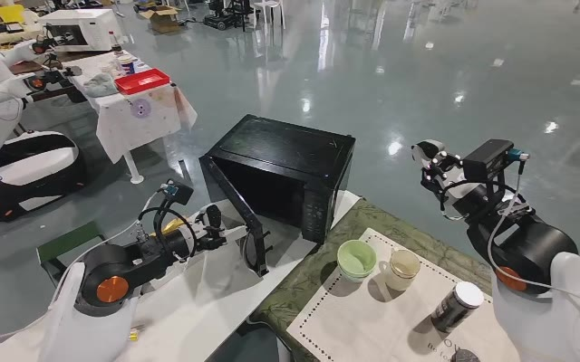
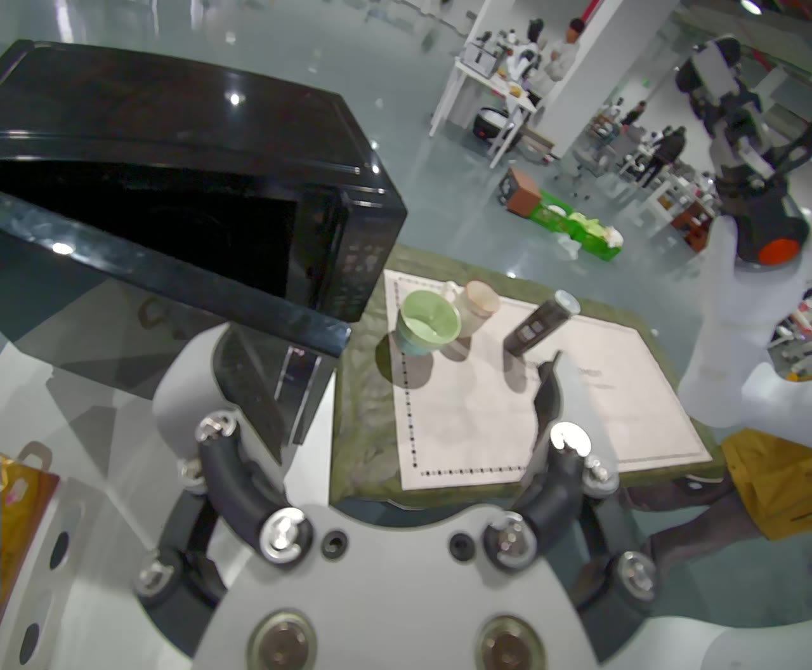
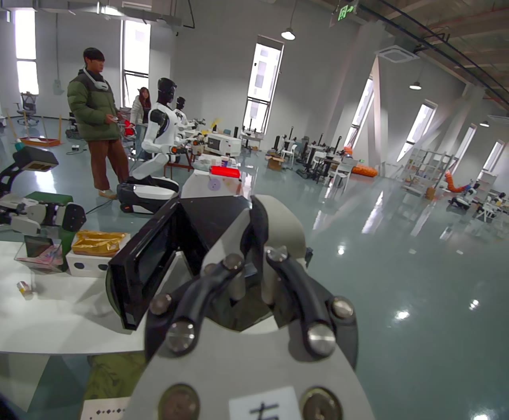
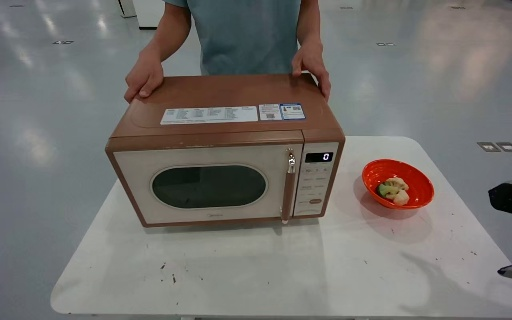
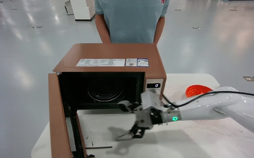

# High-level examples

These examples were selected from validation demonstrations and run with the
released weights. Input observations and saved predictions are included so you
can inspect the results directly.

## Proposal: close the microwave

The current task phase is to close the microwave door. The three camera views
show the open door and the arms' positions.

| Head | Left wrist | Right wrist |
|---|---|---|
|  |  |  |

Saved proposal:

> Close the microwave door on the table with the left arm.

The full output, including reasoning and memory, is in
[`proposal/prediction.json`](proposal/prediction.json).
[`proposal.jsonl`](proposal.jsonl) contains the input without reference answers.

## World model: open the microwave

Instruction: **Open the microwave door on the table with the right arm.**

| Input observation | Generated goal image |
|---|---|
|  |  |

Run [`world_model.jsonl`](world_model.jsonl) to generate this goal image with the
default inference settings. This is a separate observation from the proposal
example above.

## Prepare and fine-tune

From the repository root:

```bash
python scripts/make_high_level_example.py
```

This copies the examples to `outputs/high_level_example` without needing FFmpeg.
The `*_sft.jsonl` files provide annotations and demonstration target images for
the fine-tuning tutorials. Dataset identifiers and asset checksums are recorded
in [`provenance.json`](provenance.json).
